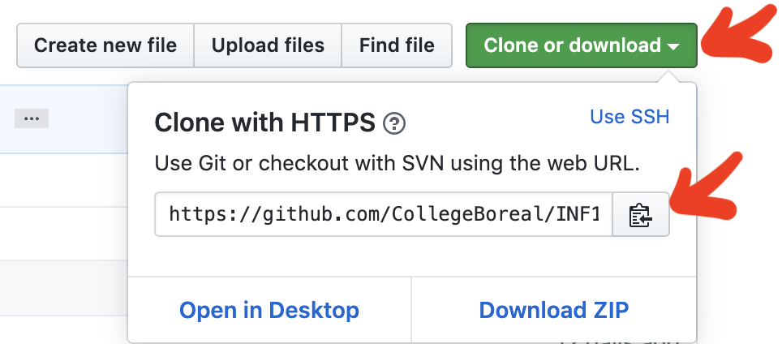

# GIT 

## :bookmark: [Emoji Flags](flags.md)

## :octocat: [Cheat Sheet](https://education.github.com/git-cheat-sheet-education.pdf)

## Decouvrir git

https://www.lynda.com/fr/Git-tutorials/Decouverte-Git/546576-2.html?org=collegeboreal.ca

10 git commands you should know

https://towardsdatascience.com/10-git-commands-you-should-know-df54bea1595c

## Installation de la gestion de source

* git Client : https://git-scm.com/downloads  
* [Livre git](https://git-scm.com/book/fr/v2)

## Les premiers pas avec git

* Ouvrir la fenetre Git bash
* Creer un repertoire pour faire du développement (en anglais et avec `D` en majuscule)
```
$ mkdir Developer
```
* changer de repertoire pour faire du développement
```
$ cd Developer
```

* Cloner votre premier repertoire git

   - aller sur la page github du cours
   
   - cliquer sur le bouton `clone or download`
   
   - cliquer sur le `presse papier` pour mettre en mémoire l'URL du répertoire

   </image>

   - coller l'URL du répertoire en mémoire dans le presse papier avec RIGHT-CLICK/PASTE
   
   - * example

   ```
   $ git clone https://github.com/CollegeBoreal/INF1039-202-19A-01.git
   
* allez dans le répertoire du cours

```
$ cd INF1039-202-19A-01
```

## Creer son premier fichier sous git (utiliser vi)
* Creer un fichier et l'editer 
```
$ nano 300098957.md
```
* mettre le fichier en scene (add to stage)
```
$ git add .
```
> Vérifier son status avec (doit etre vert)  
    ```
    $ git status
    ```

* donner un commentaire aux fichiers a enregistrer (commit)
```
$ git commit -m "Mon commentaire"
```

:warning: Se referer à la section `Configuration d'informations personnelles` pour le premier `commit`

* envoyer les modifications locales au serveur github
```
$ git push
```

## Configuration d'informations personnelles `~/.gitconfig`

:bulb: pour soumettre son travail vers `github.com`

* Changer l'éditeur par défaut de `vi` à `nano`

```
$ git config --global core.editor "nano"
```

* Editer son nom utilisateur `github` et son courriel

```
$ git config --global --edit
```

* Rajouter la section `[user]` et remplacer `MonNom` et `MonCourriel@me_remplacer.com` par le votre

```
[core]
        editor = nano

[user]
# Please adapt and uncomment the following lines:
        name = MonNom
        email = MonCourriel@me_remplacer.com
```

## Metter à jour mon rèpertoire local (pull)
```
$ git pull 
```

# Suppressions

## Supprimer un fichier appellé `monfichier.md`
```
$ git rm monfichier.md 
```

## Supprimer (réccursivement) un répertoire appellé `monrepertoire`
```
$ git rm -rf monrepertoire 
```

# [http buffer](https://stackoverflow.com/questions/6842687/the-remote-end-hung-up-unexpectedly-while-git-cloning)

```
error: RPC failed; curl 18 transfer closed with outstanding read data remaining
fatal: The remote end hung up unexpectedly
fatal: early EOF
fatal: index-pack failed
```

* Modifier le buffer

```
$ git config --global http.postBuffer 1048576000
```

La suite du fichier de configuration `~/.gitconfig` devrait ressembler à ceci

```
...

[http]
        postBuffer = 1048576000
```


# Gestion des fichiers volumineux

* Utiliser LFS (Large File System)

```
$ git lfs install
```

La suite du fichier de configuration `~/.gitconfig` devrait ressembler à ceci

```
[filter "lfs"]
        clean = git-lfs clean -- %f
        smudge = git-lfs smudge -- %f
        process = git-lfs filter-process
        required = true
[http]
        postBuffer = 1048576000
```

# Configurer git (Clé personnelle)

### .ssh/config
```
Host github.com
    HostName github.com
    User git
    IdentityFile ~/.ssh/github.com.pk
```

# Git & zsh

https://www.howtogeek.com/362409/what-is-zsh-and-why-should-you-use-it-instead-of-bash/


# Tutoriel sur Vim (Éditeur utilisé par Unix)

https://www.filesilo.co.uk/video-tutorials/introduction-to-vim/


### Git guidelines:
```
1. git clone git@github.com:CollegeBoreal/Promotion.git
2. cd Promotion
3. git checkout -b add-feature-A
4. # Work on feature A
5. git add ...
6. git commit -m ...
7. # Push the branch to github so you can create a PR
8. git push origin add-feature-A
9. # Create a PR in github, dicuss etc
10. # Do some more work
11. git add ...
12. git commit -m ...
13. git push origin add-feature-A
14. # Before merging the PR, squash any unnecessary commits, and maybe rebase the branch to
15. git fetch origin
16. git rebase -i origin/master
17. # You need to force-push here. Make sure you are pushing to the correct branch! (not master!)
18. git push -f origin add-feature-A
19. # Now merge the PR in github
20. # Finally delete the topic branch (via github web or cli)
```
=======
tutoriel test # Tutoriel
