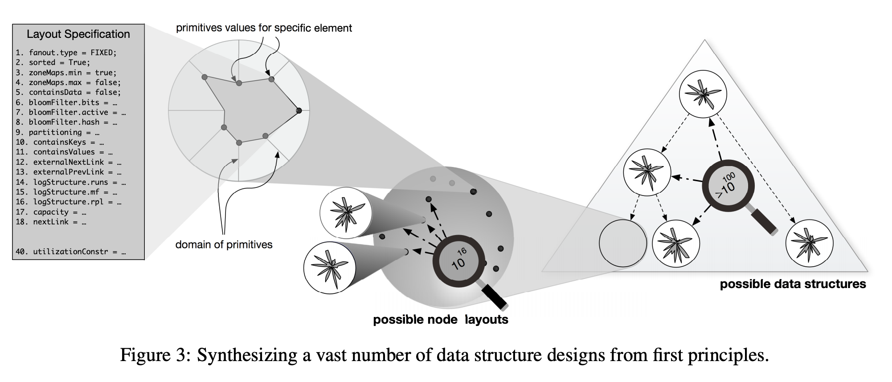

# The Periodic Table of Data Structures

https://stratos.seas.harvard.edu/files/stratos/files/periodictabledatastructures.pdf

```
There is no perfect data structure design;
```





# References:

https://www.freecodecamp.org/news/what-makes-apache-kafka-so-fast-a8d4f94ab145/

* MongoDB uses BTree

* Cassandra uses LSM tree.

* Kafka uses Queue and Protocol Buffers
