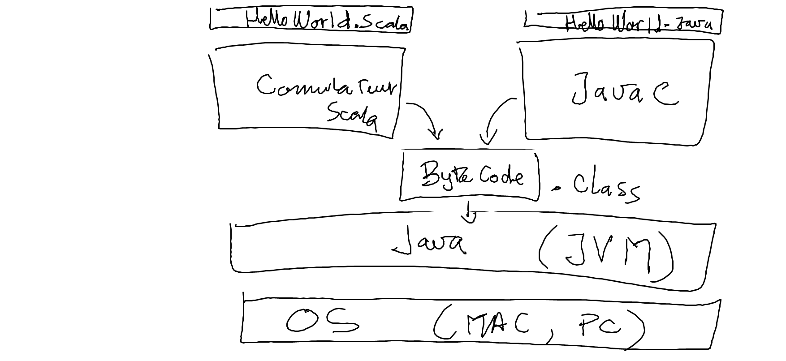

# J.JVM (Java Virtual Machine)



## :o: Installation de [sdkman](https://sdkman.io)

:round_pushpin: Installer dans le terminal

:computer: Sous Windows installer avec gitbash

```
curl -s "https://get.sdkman.io" | bash
```

:apple: Sous Apple installer avec zsh

```
curl -s "https://get.sdkman.io" | zsh
```

:round_pushpin: ouvrir un autre terminal et verifier l'installation

```
sdk version  
```
```text
SDKMAN!
script: 5.18.2
native: 0.4.2
```


## :a: Installation de la machine virtuelle java

* Installer dans le terminal

```
sdk install java
```

* Pour tester l'installation

```bash
java --version
```
> Retourne :
```python
openjdk 11.0.5 2019-10-15
OpenJDK Runtime Environment AdoptOpenJDK (build 11.0.5+10)
OpenJDK 64-Bit Server VM AdoptOpenJDK (build 11.0.5+10, mixed mode)
```

## :b: Lister les version


```bash
sdk list java
```

<details><summary>🪵 Log</summary>

================================================================================
Available Java Versions for macOS ARM 64bit
================================================================================
 Vendor        | Use | Version      | Dist    | Status     | Identifier
--------------------------------------------------------------------------------
 Corretto      |     | 26.0.1       | amzn    |            | 26.0.1-amzn         
               |     | 25.0.3       | amzn    |            | 25.0.3-amzn         
               |     | 21.0.11      | amzn    |            | 21.0.11-amzn        
               |     | 17.0.19      | amzn    |            | 17.0.19-amzn        
               |     | 11.0.31      | amzn    |            | 11.0.31-amzn        
               |     | 8.0.472      | amzn    |            | 8.0.472-amzn        
               |     | 8.0.372      | amzn    | local only | 8.0.372-amzn        
 Gluon         |     | 22.1.0.1.r17 | gln     |            | 22.1.0.1.r17-gln    
               |     | 22.1.0.1.r11 | gln     |            | 22.1.0.1.r11-gln    
 GraalVM CE    |     | 25.0.2       | graalce |            | 25.0.2-graalce      
               |     | 21.0.2       | graalce |            | 21.0.2-graalce      
               |     | 17.0.9       | graalce |            | 17.0.9-graalce      
 GraalVM Oracle|     | 26.ea.13     | graal   |            | 26.ea.13-graal      
               |     | 25.0.3       | graal   |            | 25.0.3-graal        
               |     | 21.0.11      | graal   |            | 21.0.11-graal       
               |     | 17.0.12      | graal   |            | 17.0.12-graal       
 Java.net      |     | 27.ea.30     | open    |            | 27.ea.30-open       
               |     | 27.ea.25     | open    |            | 27.ea.25-open       
               |     | 27.ea.24     | open    |            | 27.ea.24-open       
               |     | 26.ea.35     | open    |            | 26.ea.35-open       
               |     | 26.0.1       | open    |            | 26.0.1-open         
               |     | 25.0.2       | open    |            | 25.0.2-open         
               |     | 21.0.2       | open    |            | 21.0.2-open         
 JetBrains     |     | 25.0.3       | jbr     |            | 25.0.3-jbr          
               |     | 21.0.11      | jbr     |            | 21.0.11-jbr         
               |     | 17.0.14      | jbr     |            | 17.0.14-jbr         
               |     | 11.0.14.1    | jbr     |            | 11.0.14.1-jbr       
:
```

</details>
