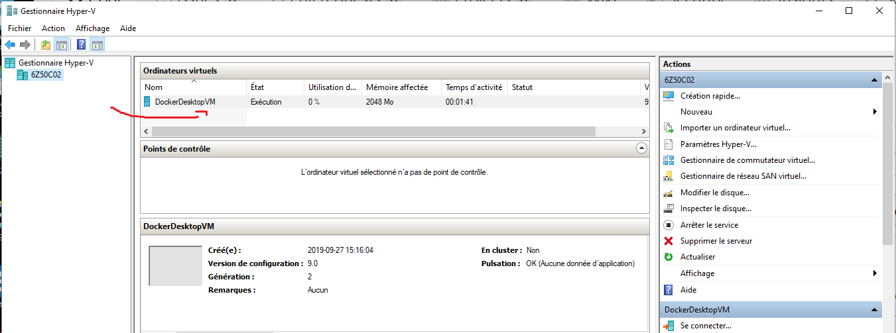

# Hyper-V


:one: - [BCD (Boot Configuration Data)](https://docs.microsoft.com/en-us/windows-hardware/manufacture/desktop/bcdedit-command-line-options) Set Hyper-V Auto

Utiliser `PowerShell` pour mettre à jour le type de démarrage de l'`Hypervisor`  (i.e. Auto/Off)

```
PS > bcdedit /set HypervisorLaunchType Auto
```


:three: - S'assurer que Docker est démarré


:four: - S'assurer que le service HyperV est démarré 



:five: - S'assurer que le service HyperV est démarré 


:six: - S'assurer que le service HyperV est démarré 


