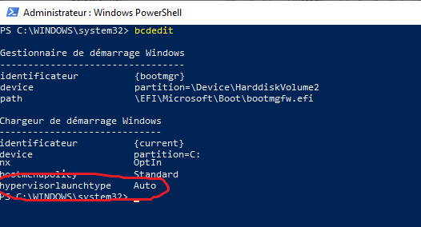

# Hyper-V


[Boot Configuration Data](https://docs.microsoft.com/en-us/windows-hardware/manufacture/desktop/bcdedit-command-line-options)

Utiliser `PowerShell` pour mettre à jour le type d'Hypervisor à démarrer (i.e. Auto/Off)

```
PS > bcdedit /set HypervisorLaunchType Auto
```


