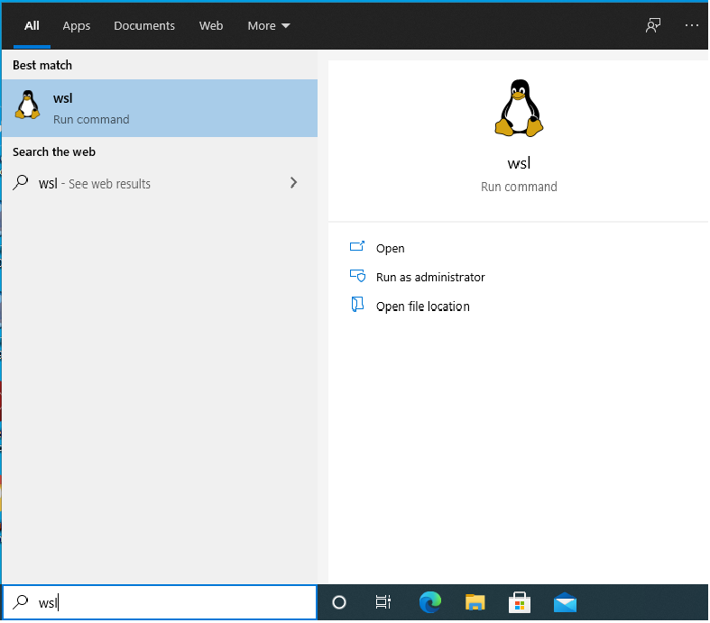
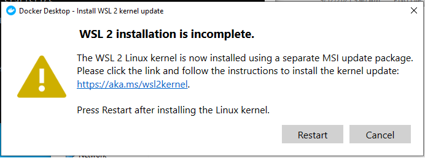

# WSL2


```powershell
Enable-WindowsOptionalFeature -Online -FeatureName $("VirtualMachinePlatform", "Microsoft-Windows-Subsystem-Linux")
```


```powershell
wsl --set-default-version 2
```




</img>


## :two: Install Linux Distro from Microsoft Store

Ubuntu default sudo password `ubuntu`


# References

https://docs.microsoft.com/en-us/windows/wsl/install-win10#step-4---download-the-linux-kernel-update-package
