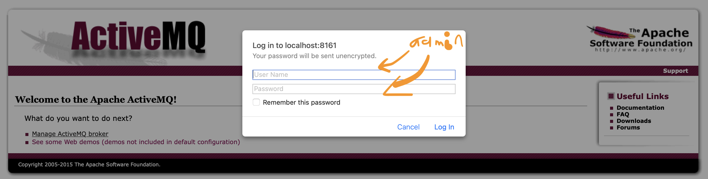

# [Podman](https://podman.io/getting-started/installation)

## :gear: [Installation](https://podman.io/getting-started/installation)

The Mac client is available through Homebrew:

```
brew install podman
```

To start the Podman-managed VM:

```
podman machine init; \
podman machine start
```

You can then verify the installation information using:

```
podman info
```

```
podman machine ls
```

:bulb: alias is needed

* add the below alias to `.zshrc`

```
alias docker=podman
```

## :x: Delete

* stop machine

```
podman machine stop
```

* remove machine

```
podman machine rm
```

## :cl: Examples

```
podman container run --name activemq --publish 61616:61616 --publish 8161:8161 --detach rmohr/activemq
```

```
open http://localhost:8161/
```



# References

- [ ] [Podman can't run command on M1 with container built on X86](https://github.com/containers/podman/issues/12144)

Docker uses the same `qemu-user-static`, and the same [binfmt_misc](https://en.wikipedia.org/wiki/Binfmt_misc) feature of Linux in order to do this.

* Install `qemu-user-static`

```
podman machine ssh sudo rpm-ostree install qemu-user-static  
```

* Reboot `systemd`

```
podman machine ssh sudo systemctl reboot
```

* Test arm64 is running 

```
$ podman-remote run -it arm64v8/alpine
/ # exit
```
