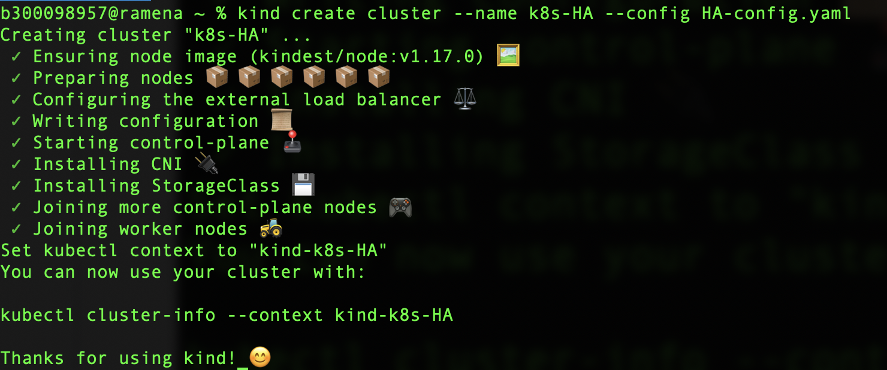

# kind - Kubernetes In Docker


# :warning: Tries to install Docker-Desktop (on Windows Server)

| Docker Engine | Windows | Linux | 
|---------------|---------|-------|
| kind          | :heavy_check_mark: | :heavy_check_mark: |


## :o: Install

:star: Windows

```
choco install kind
```

:star: MacOS

```
brew install kind
```

## :one: Run single node


```
kind create cluster --name k8s
```

</img>

```
% kubectl config get-contexts   
CURRENT   NAME       CLUSTER    AUTHINFO   NAMESPACE
*         kind-k8s   kind-k8s   kind-k8s   
          minikube   minikube   minikube  
```

```
$ kubectl config use-context kind-k8s
```

## :two: Run multiple nodes

:pushpin: Edit file `HA-config.yaml`

```yaml
# HA-config.yaml
kind: Cluster
apiVersion: kind.sigs.k8s.io/v1alpha4
nodes:
- role: control-plane
- role: control-plane
- role: control-plane
- role: worker
- role: worker
- role: worker
```

:pushpin: Run the cluster

```
$ kind create cluster --name k8s-HA --config HA-config.yaml 
```

</img>

```
% kubectl config get-contexts                              
CURRENT   NAME          CLUSTER       AUTHINFO      NAMESPACE
          kind-k8s      kind-k8s      kind-k8s      
*         kind-k8s-HA   kind-k8s-HA   kind-k8s-HA   
          minikube      minikube      minikube  
```

</img>

```
% docker container ls
CONTAINER ID        IMAGE                          COMMAND                  CREATED             STATUS              PORTS                       NAMES
ebe6e1909630        kindest/haproxy:2.1.1-alpine   "/docker-entrypoint.…"   11 minutes ago      Up 10 minutes       127.0.0.1:32769->6443/tcp   k8s-HA-external-load-balancer
ee69b7df41e2        kindest/node:v1.17.0           "/usr/local/bin/entr…"   11 minutes ago      Up 10 minutes       127.0.0.1:32771->6443/tcp   k8s-HA-control-plane2
c31b5b78f6bc        kindest/node:v1.17.0           "/usr/local/bin/entr…"   11 minutes ago      Up 10 minutes       127.0.0.1:32772->6443/tcp   k8s-HA-control-plane3
0b39419ee411        kindest/node:v1.17.0           "/usr/local/bin/entr…"   11 minutes ago      Up 10 minutes                                   k8s-HA-worker2
41263a31705b        kindest/node:v1.17.0           "/usr/local/bin/entr…"   11 minutes ago      Up 10 minutes                                   k8s-HA-worker3
d46142a52631        kindest/node:v1.17.0           "/usr/local/bin/entr…"   11 minutes ago      Up 10 minutes                                   k8s-HA-worker
711bb57a4cd9        kindest/node:v1.17.0           "/usr/local/bin/entr…"   11 minutes ago      Up 10 minutes       127.0.0.1:32770->6443/tcp   k8s-HA-control-plane
6aa18a6815b1        kindest/node:v1.17.0           "/usr/local/bin/entr…"   20 minutes ago      Up 20 minutes       127.0.0.1:32768->6443/tcp   k8s-control-plane
```

```
% kubectl get nodes                     
NAME                    STATUS   ROLES    AGE   VERSION
k8s-ha-control-plane    Ready    master   17m   v1.17.0
k8s-ha-control-plane2   Ready    master   17m   v1.17.0
k8s-ha-control-plane3   Ready    master   16m   v1.17.0
k8s-ha-worker           Ready    <none>   15m   v1.17.0
k8s-ha-worker2          Ready    <none>   15m   v1.17.0
k8s-ha-worker3          Ready    <none>   15m   v1.17.0
```

## :x: Remove Cluster

```
% kind delete cluster --name k8s
```

```
% kubectl config get-contexts                              
CURRENT   NAME          CLUSTER       AUTHINFO      NAMESPACE
*         kind-k8s-HA   kind-k8s-HA   kind-k8s-HA   
          minikube      minikube      minikube   
```

## :x: Force removing if issues

```
% rm ~/.kube/config
```

```
% docker rm -f `docker container ls -q`
```

# References

- [ ] [Launching Remote KIND (Kubernetes in Docker) Clusters](https://www.mendrugory.com/post/remote-kind)
