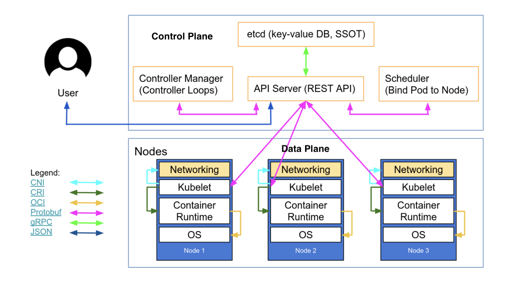

# k8s :wheel_of_dharma: 

</img> 

| Plane Type                        | Comments |
|-----------------------------------|----------|
| [ :control_knobs: Control Plane](control-plane.md) |          | 
| [ :abacus: Data Plane](data-plane.md)       |          | 
| [ :battery: Storage Class](storage-class)         |          |
| [ :link: Expose EIP](expose-eip)           | Expose External IP Address         | 
| [ :bar_chart: Dashboard](dashboard.md)         |          |


| Management |.  |
|------------|---|
| [Token](https://kubernetes.io/docs/reference/setup-tools/kubeadm/kubeadm-token/) | |


- [ ] run a pod

```
$ kubectl apply -f https://k8s.io/examples/pods/commands.yaml
pod/command-demo created
```

- [ ] Check its status


```
$ kubectl get pods
NAME           READY   STATUS              RESTARTS   AGE
command-demo   0/1     ContainerCreating   0          16s
```

- [ ] When completed

```
$ kubectl get pods      
NAME                                READY   STATUS      RESTARTS   AGE
command-demo                        0/1     Completed   0          16h
```

- [ ] [Delete a completed pod](https://stackoverflow.com/questions/55072235/how-to-delete-completed-kubernetes-pod)

```
% kubectl get pod --field-selector=status.phase==Succeeded
NAME                            READY   STATUS      RESTARTS   AGE
command-demo                    0/1     Completed   0          16h
```

Apply a filter

```
$ kubectl delete pod --field-selector=status.phase==Succeeded
pod "command-demo" deleted
```

:x: Troubleshooting

[stuck-on-containercreating](https://serverfault.com/questions/728727/kubernetes-stuck-on-containercreating)

```
$ kubectl describe pods
```


# References:

https://learnk8s.io/how-many-clusters#2-many-small-single-use-clusters

https://betterprogramming.pub/a-closer-look-at-etcd-the-brain-of-a-kubernetes-cluster-788c8ea759a5

https://www.reddit.com/r/kubernetes/comments/kwyqhu/who_is_running_kubernetes_on_bare_metal/
