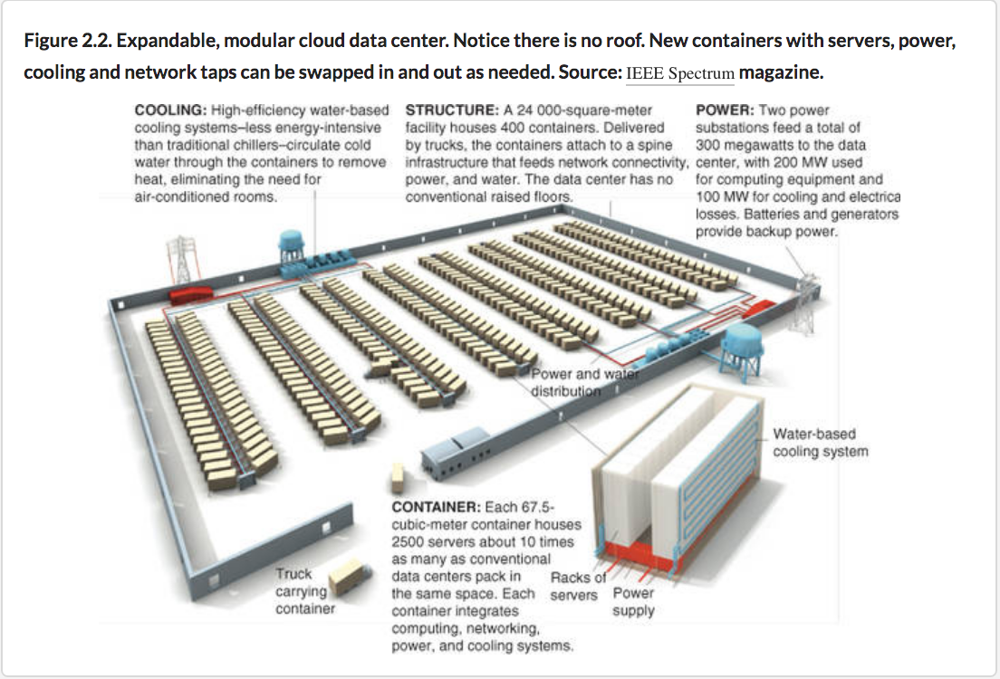
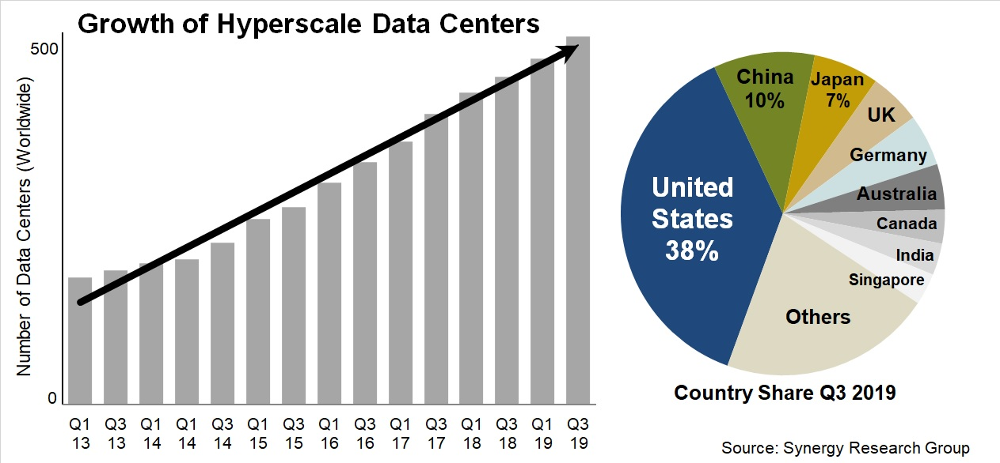
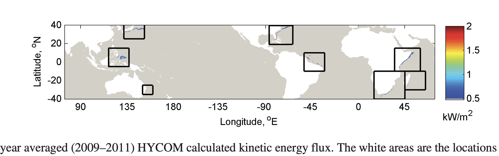
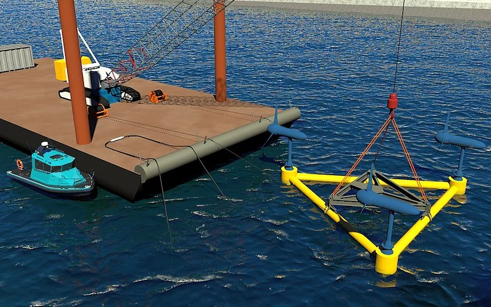
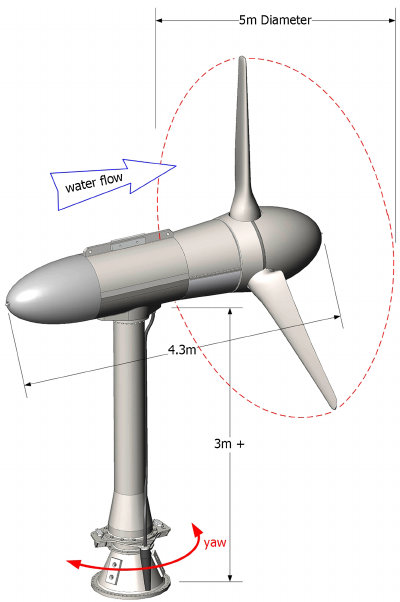
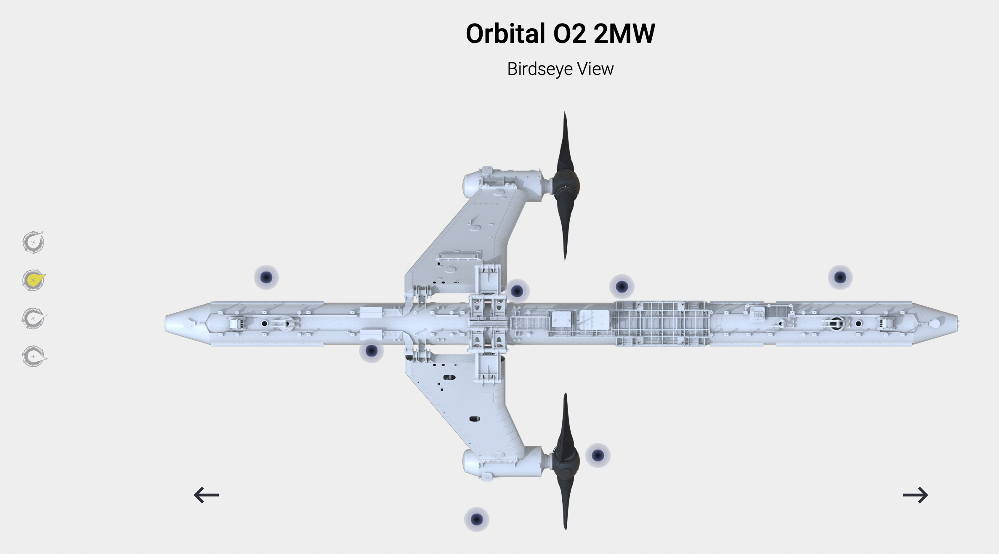
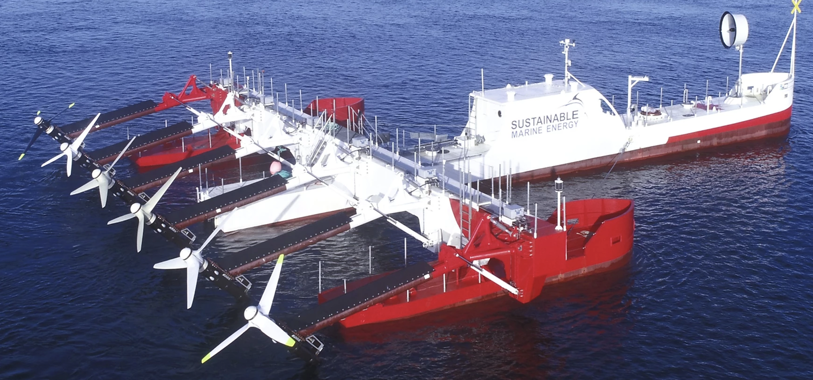
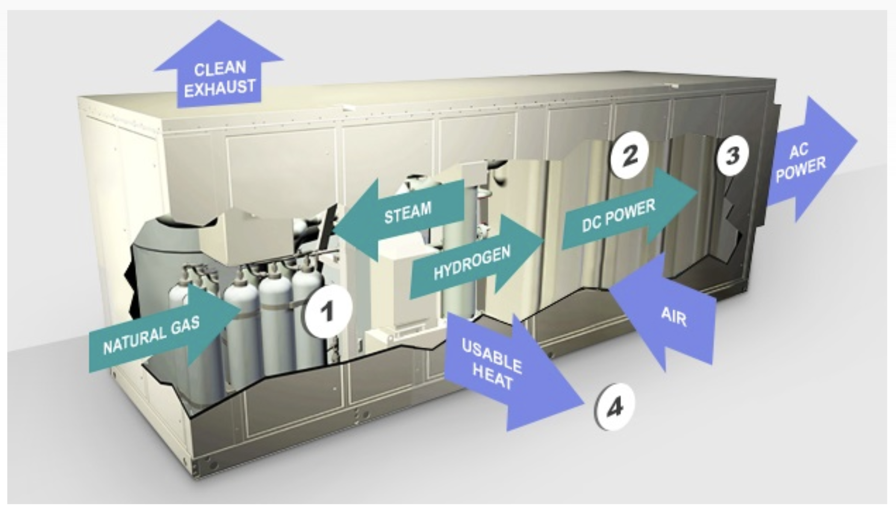
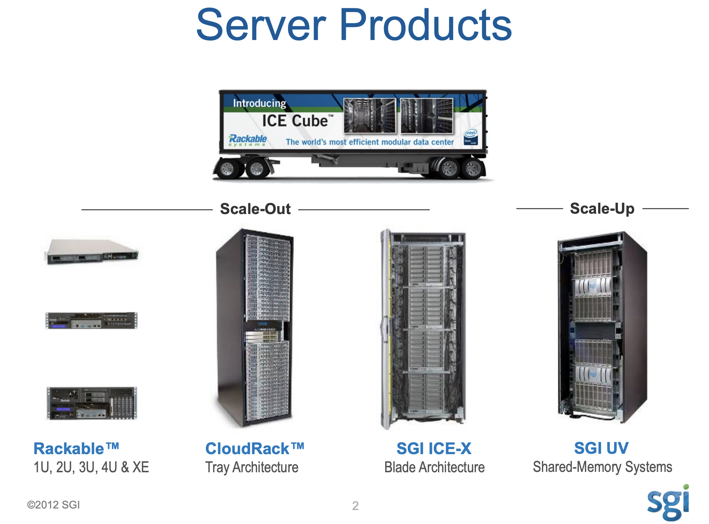

# Cloud

-In computing, hyperscale is the ability of an architecture to scale appropriately as increased demand is added to the system.
 
-[:one: Definition](1.Definition)

## :pushpin: Hyperscale Data Center 

</img>

- [ ] [passed 500 Q32019](https://www.srgresearch.com/articles/hyperscale-data-center-count-passed-500-milestone-q3)

</img>

## :a: Power

### :pushpin: Hydrokinetic Power

- [ ] HYCOM Hydro Energetic Flux

</img>  

[In-Stream Hydrokinetic Power: Review and Appraisal](images/28asce29ey2E1943-78972E0000197.pdf)

### :ocean: Tidal Turbine

:star: https://www.verdantpower.com/riteproject

And on January 23, 2012, FERC issued Verdant Power a 10-year license to install up to `1 MW of power` `(30 turbines/10 TriFrames)` at the RITE Project, making it the first commercially-licensed tidal power project in the US. 

|  :one: `Triframe` Installation  |  :two: `Turbine`            |
|-----------------|--------------|
| </img> |  |

:star: https://www.verdantpower.com/project-development

Systems can be deployed in `units` ranging from 100kW - 600kW for village power ranging up to <b><i>5 MW</i></b>, and with `larger units` of 350 kW to 1.5 MW for `utility-scale` projects ranging up to <b><i>500 MW</i></b>.

:star: https://orbitalmarine.com/o2/

https://www.popsci.com/science/article/2010-05/sea-kites-could-harness-tidal-energy-future-power-plants/

</img>  

:star: [Pempa’q](https://www.sustainablemarine.com/pempa-q) Project

[Nearly 300 megawatts of tidal energy potential in the Minas Passage](https://www.naturalresourcesmagazine.net/article/down-under)

https://atlantic.ctvnews.ca/harnessing-the-bay-of-fundy-new-platform-has-turbines-like-a-boat-s-outboard-motor-1.5291064

https://www.cnn.com/2021/11/11/tech/tidal-energy-climate-change-renewable

https://www.sustainablemarine.com/plat-i-6-40

</img>  

##### :pushpin: Fuel Cell Energy

:bulb: PureCell® Model 400

[Inside the Purecell System](http://www.doosanfuelcellamerica.com/en/fuel-cell-solutions/inside-the-purecell-system/)

</img>  

CBS Installs PureCell® Model 400 Systems -- Timelapse Video

https://youtu.be/1LkGda8TQ3g?t=90

## :b: Data Center

##### :pushpin: Modular 

</img> 

https://www.slideshare.net/datacenters/next-generation-data-center-infrastructure

https://youtube.com/watch?v=DLjBecEbNMA

https://www.ecmwf.int/sites/default/files/elibrary/2012/14029-sgi-update.pdf

##### :pushpin: Underwatwer 

https://news.microsoft.com/innovation-stories/project-natick-underwater-datacenter/

# References

:star: the average household electricity consumption kWh per day is 28.9 kWh (867 kWh / 30 days).

https://electricityplans.com/kwh-kilowatt-hour-can-power/

:star: TTC buying electric buses support clean air targets

https://urbantoronto.ca/news/2018/06/ttc-buying-electric-buses-support-clean-air-targets

