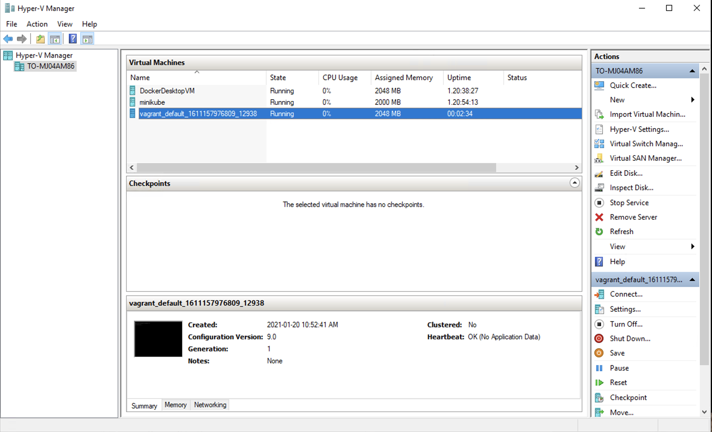

:bulb: Pour créer une machine sous `Hyper-V`, il faut avoir les droits administrateurs. Vous pouvez utiliser `git bash`


```
$ vagrant up --provider=hyperv
Bringing machine 'default' up with 'hyperv' provider...
==> default: Verifying Hyper-V is enabled...
==> default: Verifying Hyper-V is accessible...
==> default: Box 'generic/ubuntu2010' could not be found. Attempting to find and install...
    default: Box Provider: hyperv
    default: Box Version: >= 0
==> default: Loading metadata for box 'generic/ubuntu2010'
    default: URL: https://vagrantcloud.com/generic/ubuntu2010
==> default: Adding box 'generic/ubuntu2010' (v3.1.22) for provider: hyperv
    default: Downloading: https://vagrantcloud.com/generic/boxes/ubuntu2010/versions/3.1.22/providers/hyperv.box
Download redirected to host: vagrantcloud-files-production.s3.amazonaws.com
    default:
    default: Calculating and comparing box checksum...
==> default: Successfully added box 'generic/ubuntu2010' (v3.1.22) for 'hyperv'!
==> default: Importing a Hyper-V instance
    default: Creating and registering the VM...
    default: Successfully imported VM
    default: Configuring the VM...
    default: Setting VM Enhanced session transport type to disabled/default (VMBus)
==> default: Starting the machine...
==> default: Waiting for the machine to report its IP address...
    default: Timeout: 120 seconds
    default: IP: 172.17.110.115
==> default: Waiting for machine to boot. This may take a few minutes...
    default: SSH address: 172.17.110.115:22
    default: SSH username: vagrant
    default: SSH auth method: private key
    default:
    default: Vagrant insecure key detected. Vagrant will automatically replace
    default: this with a newly generated keypair for better security.
    default:
    default: Inserting generated public key within guest...
    default: Removing insecure key from the guest if it's present...
    default: Key inserted! Disconnecting and reconnecting using new SSH key...
==> default: Machine booted and ready!
```


```
$ vagrant status
Current machine states:

default                   running (hyperv)
```

```
$ vagrant ssh --command 'ip addr'
1: lo: <LOOPBACK,UP,LOWER_UP> mtu 65536 qdisc noqueue state UNKNOWN group default qlen 1000
    link/loopback 00:00:00:00:00:00 brd 00:00:00:00:00:00
    inet 127.0.0.1/8 scope host lo
       valid_lft forever preferred_lft forever
2: eth0: <BROADCAST,MULTICAST,UP,LOWER_UP> mtu 1500 qdisc mq state UP group default qlen 1000
    link/ether 00:15:5d:02:53:13 brd ff:ff:ff:ff:ff:ff
    inet 172.17.110.115/28 brd 172.17.110.127 scope global dynamic eth0
       valid_lft 86316sec preferred_lft 86316sec
    inet6 fe80::215:5dff:fe02:5313/64 scope link
       valid_lft forever preferred_lft forever
Connection to 172.17.110.115 closed.
```

```
PS > get-vm

Name                                State   CPUUsage(%) MemoryAssigned(M) Uptime             Status             Version
----                                -----   ----------- ----------------- ------             ------             -------
DockerDesktopVM                     Running 0           2048              1.20:54:18.5610000 Operating normally 9.0
minikube                            Running 0           2000              1.21:10:05.2680000 Operating normally 9.0
vagrant_default_1611157976809_12938 Running 0           2048              00:18:24.6290000   Operating normally 9.0
```

</img>
