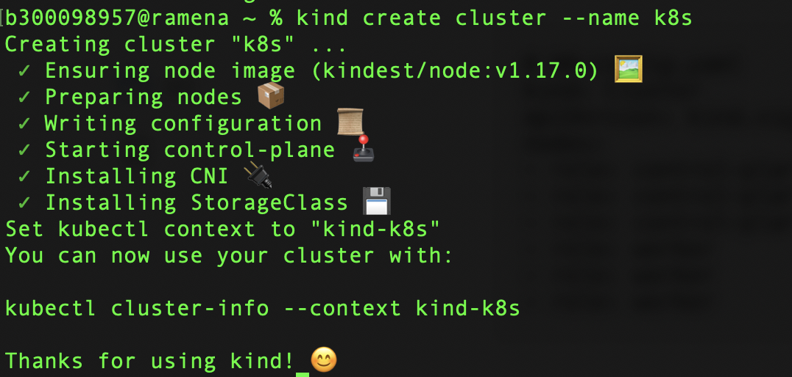
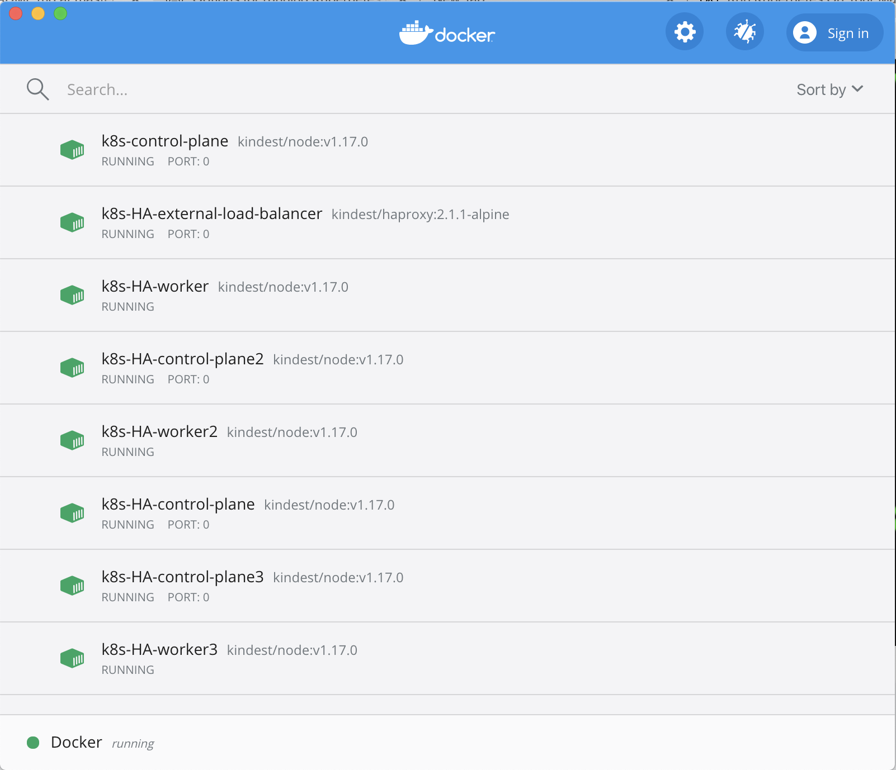

# kind - Kubernetes In Docker


## :o: Install

:star: Windows

```
$ choco install kind
```

:star: MacOS

```
$ brew install kind
```

## :one: Run single node


```
% kind create cluster --name k8s
```

</img>

```
% kubectl config get-contexts   
CURRENT   NAME       CLUSTER    AUTHINFO   NAMESPACE
*         kind-k8s   kind-k8s   kind-k8s   
          minikube   minikube   minikube  
```

```
$ kubectl config use-context kind-k8s
```

## :two: Run multiple nodes

:pushpin: Edit file `HA-config.yaml`

```yaml
# HA-config.yaml
kind: Cluster
apiVersion: kind.sigs.k8s.io/v1alpha3
nodes:
- role: control-plane
- role: control-plane
- role: control-plane
- role: worker
- role: worker
- role: worker
```

:pushpin: Run the cluster

```
$ kind create cluster --name k8s-HA --config HA-config.yaml 
```

</img>

```
% kubectl config get-contexts                              
CURRENT   NAME          CLUSTER       AUTHINFO      NAMESPACE
          kind-k8s      kind-k8s      kind-k8s      
*         kind-k8s-HA   kind-k8s-HA   kind-k8s-HA   
          minikube      minikube      minikube  
```

</img>
