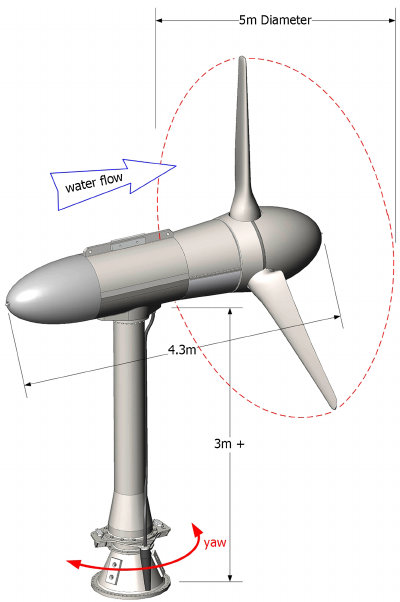

# Cloud

## :pushpin: Hyperscale Data Center 

</img>

## :pushpin: Energy Examples

:star: https://www.verdantpower.com/riteproject

And on January 23, 2012, FERC issued Verdant Power a 10-year license to install up to `1 MW of power` `(30 turbines/10 TriFrames)` at the RITE Project, making it the first commercially-licensed tidal power project in the US. 

:star: https://www.verdantpower.com/project-development

Systems can be deployed in `units` ranging from 100kW - 600kW for village power ranging up to <b><i>5 MW</i></b>, and with `larger units` of 350 kW to 1.5 MW for `utility-scale` projects ranging up to <b><i>500 MW</i></b>.

https://electricityplans.com/kwh-kilowatt-hour-can-power/

