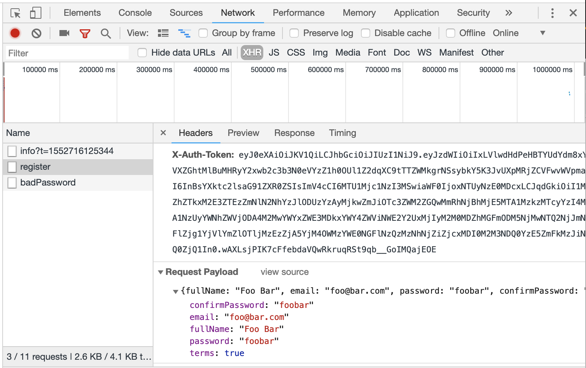

# Debug the Application

:O: After launching your browser (you should hit the login page, register first)

http://localhost:4200

:one: Debug through the console (if under Google Chrome hit key `F12` on Windows, `Option/Command J` on MacOS) 

* Header (In Network/XHR/Header Tab)

* Response (In Network/XHR/Response Tab)

* Local Storage (In Application Tab)

:bangbang: Force Login

Clear the `LocalSorage` in Application  to reset the `token`

