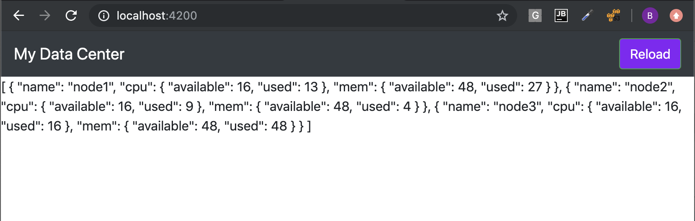

# Displaying Data Component

## Edit `dashboard.component.html`

   * Replace its content
   
```html
<p>{{cluster1 | json}}</p>
```

## Edit `app.component.html`

   * add the `Dashboard` Component
   
```html
<app-navbar></app-navbar>
<app-dashboard></app-dashboard>
```

# The App should sisplay




[:fast_forward: Next](metric.md)
