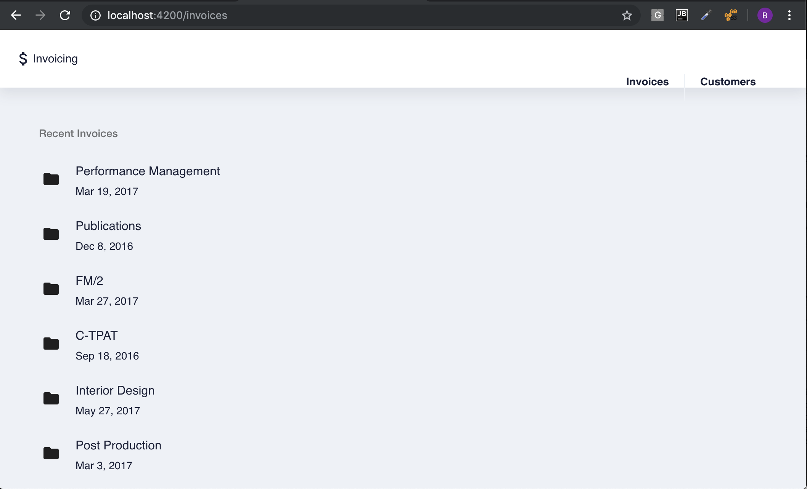

# Invoices Path

The `Invoices` components will be used to demonstrate the [`Reactive`](https://angular.io/guide/forms) Forms 

#### Master (List of all Invoices)

###### Generate `Invoices` Component

```
$ ng generate component invoices
```

###### Edit the `invoices.component.ts`

* Add the local variable `invoices` Array

```typescript
   invoices: Invoice[];
```

* Edit its `constructor` by addind the `CustomersService` class

```typescript
  constructor(private invoicesService: InvoicesService) {
  }
```

* Edit its `ngOnInit` function with the below code

```typescript
  ngOnInit() {
    this.invoicesService.query<Array<Invoice>>({sort: 'created', order: 'desc'})
      .subscribe(invoices => {
        this.invoices = invoices;
      });
  }
```

* Final Result

```typescript
@Component({
  selector: 'app-invoices',
  templateUrl: './invoices.component.html',
  styleUrls: ['./invoices.component.scss']
})
export class InvoicesComponent implements OnInit {

  invoices: Invoice[];

  constructor(private invoicesService: InvoicesService) {
  }

  ngOnInit() {
    this.invoicesService.query<Array<Invoice>>({sort: 'created', order: 'desc'})
      .subscribe(invoices => {
        this.invoices = invoices;
      });
  }

}
```

##### Invoices Component

###### ADD `Material Design` Modules used by the template

:warning: only if it is not already there

* Edit `app.module.ts` and add `MatButtonModule`, `MatListModule` and `MatIconModule` to the existing `MAT_MODULES` constant

```typescript
// Material Modules
const MAT_MODULES = [
  MatIconModule,
  MatButtonModule,
  MatListModule,
];
```

###### Edit the `invoices.component.html`


* Replace all its content by the below snippet

:warning: You may have noticed that the Angular In Action book uses `<md-list>` instead of `<mat-list>`. 
          This is due to the usage of `Material Design` in `Covalent` being old
          [deprecation-of-md-prefix](https://github.com/angular/components/blob/master/CHANGELOG.md#deprecation-of-md-prefix)

```html
  <mat-list>
    <h3 mat-subheader>Recent Invoices</h3>
    <mat-list-item *ngFor="let invoice of invoices" routerLink="/invoices/{{invoice.id}}">
      <mat-icon mat-list-icon>folder</mat-icon>
      <h4 mat-line>{{invoice.service}}</h4>
      <p mat-line> {{invoice.date | date}} </p>
    </mat-list-item>
  </mat-list>   
```


#### Routing

* Edit the `app-routing.module.ts` file and add the below route

:warning: keep other routes if you followed the `Customers` path


```typescript
const routes: Routes = [
  { path: 'invoices', component: InvoicesComponent },
  { path: '', pathMatch: 'full', redirectTo: '/invoices' },
];
```

* Edit the `app.component.html` file and add the below route link

```html
routerLink="/invoices"
```

to the `customers` action

```html
     <nb-action class="control-item" routerLink="/invoices">Invoices</nb-action>
```


### You should see this



[:fast_forward: Next ](invoice.md)
