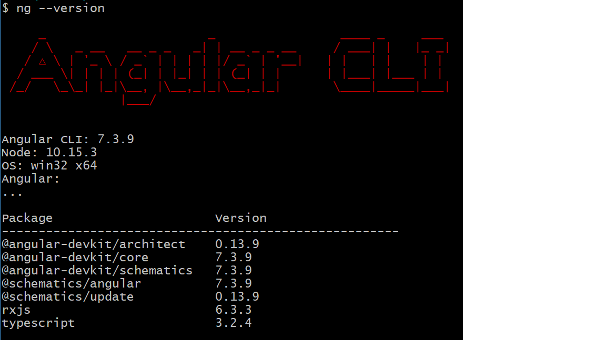

# Node.js

## Téléchargement

Suivre les instructions pour installer

https://nodejs.org/en/download/

## Versions minimales de Node and npm
```
$ node --version
v6.9.1
$ npm --version
3.10.8
```

# Angular-cli

## Site

https://cli.angular.io/

## Installation

```
$ npm install @angular/cli --global
```

## Version minimale de Angular CLI

```
$ ng --version
```




## Installation de l'environnement intégré de développement (IDE) -- Webstorm

* Intellij Webstorm : https://www.jetbrains.com/webstorm/download
* Enregistrement    : https://www.jetbrains.com/student/

## Tutoriels en français  
https://www.youtube.com/playlist?list=PLw5h0DiJ-9PD2b2tM3m7GQsHpuklT-fOT
