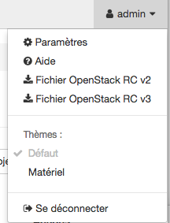

https://docs.openstack.org/devstack/latest/guides/single-machine.html

## Installation shake and bake

* Ajouter l'utilisateur `stack`

```
$ sudo useradd -s /bin/bash -d /opt/stack -m stack
```

* Comme l'utilisateur fera des modifications a votre systeme, il devra avoir des droits speciaux:

```
$ echo "stack ALL=(ALL) NOPASSWD: ALL" | sudo tee /etc/sudoers.d/stack
```

* Se Logger en tant qu'utilisateur `stack`

```
$ sudo su - stack
```

* Telecharger la derniere version de DevStack

```
$ sudo apt-get install git -y || sudo yum install -y git
$ git clone https://git.openstack.org/openstack-dev/devstack
$ cd devstack
```

* Editer le fichier local.conf

```
[[local|localrc]]
FLOATING_RANGE=10.13.237.48/28
FIXED_RANGE=172.16.0.0/24
FIXED_NETWORK_SIZE=256
FLAT_INTERFACE=enp10s0

ADMIN_PASSWORD=supersecret
DATABASE_PASSWORD=$ADMIN_PASSWORD
RABBIT_PASSWORD=$ADMIN_PASSWORD
SERVICE_PASSWORD=$ADMIN_PASSWORD
```

Faire tourner l'installation de DevStack:

```
./stack.sh
```

### apres 42 minutes

```
=========================
DevStack Component Timing
 (times are in seconds)  
=========================
run_process           21
test_with_retry        3
apt-get-update         4
osc                  164
wait_for_service      22
git_timed            184
dbsync               316
pip_install          431
apt-get              536
-------------------------
Unaccounted time     843
=========================
Total runtime        2524


This is your host IP address: 10.13.237.4
This is your host IPv6 address: ::1
Horizon is now available at http://10.13.237.4/dashboard
Keystone is serving at http://10.13.237.4/identity/
The default users are: admin and demo
The password: supersecret

WARNING: 
Using lib/neutron-legacy is deprecated, and it will be removed in the future


Services are running under systemd unit files.
For more information see: 
https://docs.openstack.org/devstack/latest/systemd.html

DevStack Version: queens
Change: d04658eb50d7e1f59625039deaef17208a0c9eb9 Stage rabbitmq and DB logs 2017-12-18 18:21:24 +0000
OS Version: Ubuntu 17.04 zesty
```

# Tester son environmment

* telecharger le fichier `openrc`. Selectionner la version 3 =>  `Fichier OpenStack RC v3`



* `sourcer` le fichier telecharge (i.e. demo-openrc.sh)

```
$ source ~/demo-openrc.sh
```

* Tester une commande

```
$ openstack user list
```

* Installer `precise` Ubuntu 14.04 LTS (marche)

```
$ cd /run/shm  
$ wget https://cloud-images.ubuntu.com/precise/current/precise-server-cloudimg-amd64-disk1.img
$ glance image-create --name "Ubuntu-14.04 LTS" --disk-format qcow2 --container-format bare --progress --file /run/shm/precise-server-cloudimg-amd64-disk1.img
```

* Installer `xenial` Ubuntu 16.04 LTS (ne marche pas)

```
$ cd /run/shm
$ wget https://cloud-images.ubuntu.com/xenial/current/xenial-server-cloudimg-amd64-disk1.img
$ glance image-create --name "Ubuntu-16.04 LTS" --disk-format qcow2 --container-format bare --progress --file /run/shm/xenial-server-cloudimg-amd64-disk1.img
```


