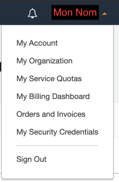
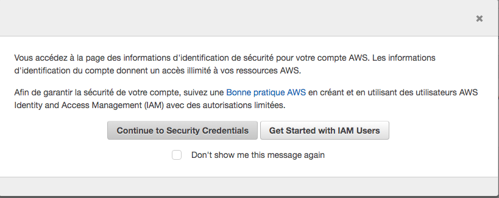

# Gestion des clés

# :one: Créer sa clé d'accès






# :two: Installer ses clés

```
$ mkdir -p ~/.aws
$ nano ~/.aws/credentials
```

#### appliquer vos identifiants

```
[default]
    aws_access_key_id = <me remplir>
    aws_secret_access_key = <me remplir>

```
