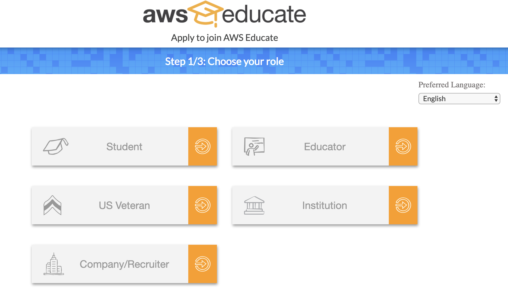
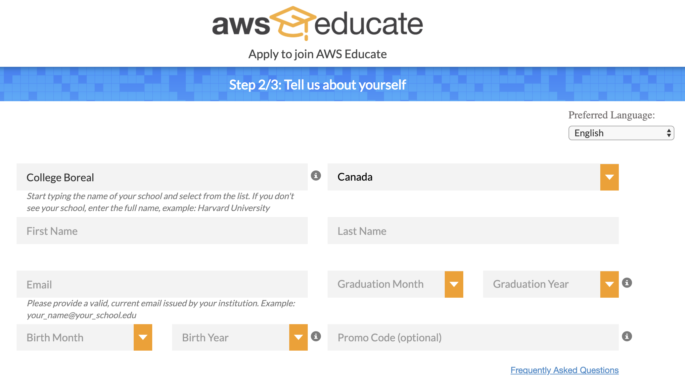

# AWS (Amazon Web Services)

## :ab: AWS Educate: Quoi?

https://www.youtube.com/watch?v=X36oOsjyoXA

Dans le cadre des cours sur l'infrastructure info-nuagique, vous aurez besoin d'un compte `AWS Educate` pour accéder aux crédits fournis par AWS 

:bulb: Les crédits sont offerts sous les formes suivantes:

| Type de crédit    | Fournisseurs                             | Avantages                                                           | 
|-------------------|------------------------------------------|---------------------------------------------------------------------|
| Code Promotionnel | [`AWS Account ID`](account)              | permet de bénéficier d'un crédit de $100 renouvellable tous les ans |
| compte débutant   | [`AWS Educate Starter Account`](starter) | permet de bénéficier d'un crédit de $75 en une fois (préférable pour les éleves sans cartes de crédit) |

[Plus d'infos](https://awseducate-onboarding.s3.amazonaws.com/Educator+Toolkit/Movies/Getting+Started+with+AWS+Educate.mp4)

## :a: Créer un compte AWS Educate

https://aws.amazon.com/fr/education/awseducate/

###### :one: Form 1/3

* Suivre les instructions de remplissage d'utilisateurs de type `Étudiants`

###### :two: Form 2/3

* Pour `étudiants`, créer le compte avec le courriel `@monboreal.ca`  

* Pour `professeurs`, créer le compte avec le courriel `@collegeboreal.ca`  

:warning: La date de fin d'études doit etre dans le futur

* Remplir la forme ci-dessous selon le modèle

---

###### :three: Form 3/3

* Choisir entre le compte régulier [`AWS Account ID`](account) ou [`AWS Educate Starter Account`](starter) 

* Pour terminer l'application appuyer sur `Submit`

* Vous recevrez des courriels vous précisant que votre application a été approuvée

## :b: Se connecter à AWS Educate

#### :m: Vérifier son crédit

https://www.awseducate.com/SiteLogin

## :o: Application Rejetée

* Si vous avez été rejeté par `AWS Educate`, contactez:

https://aws.amazon.com/education/awseducate/contact-us/ 

