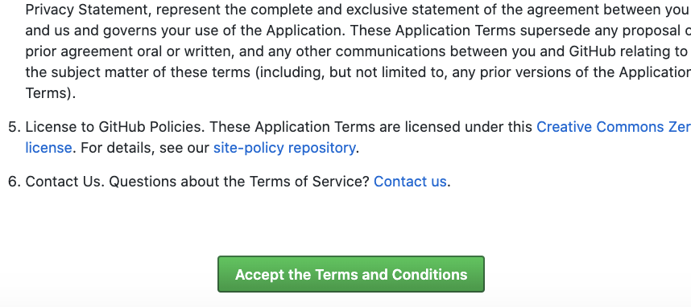
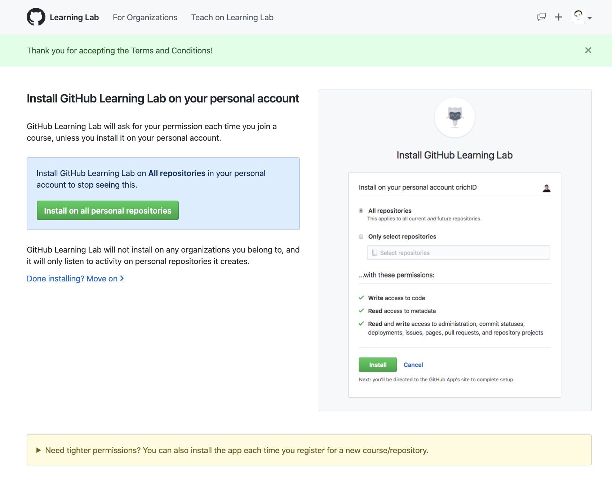
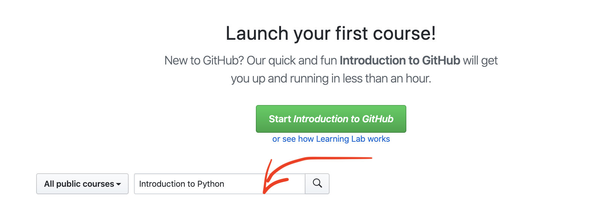
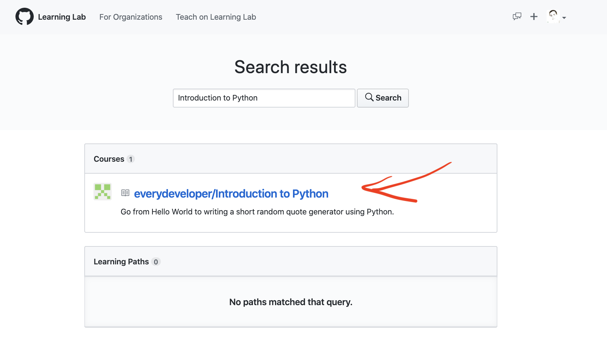
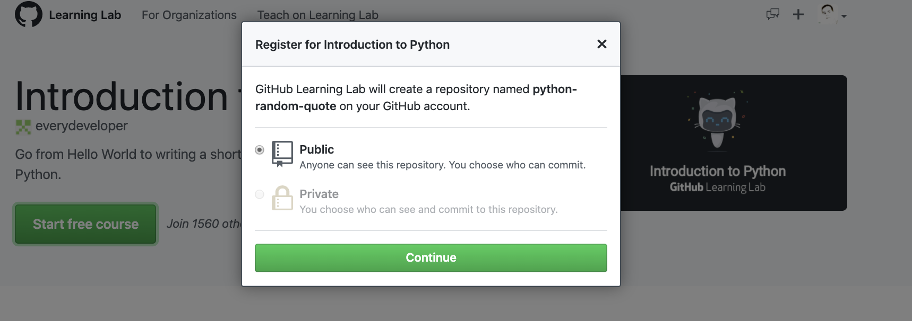
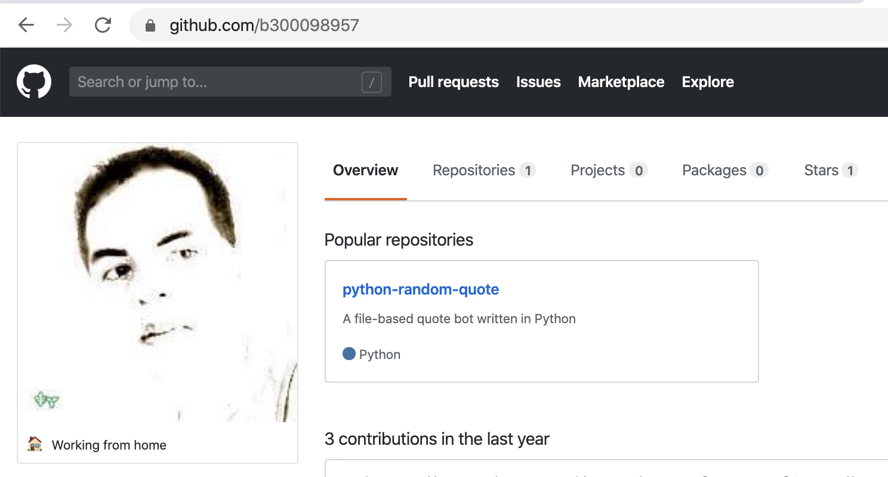
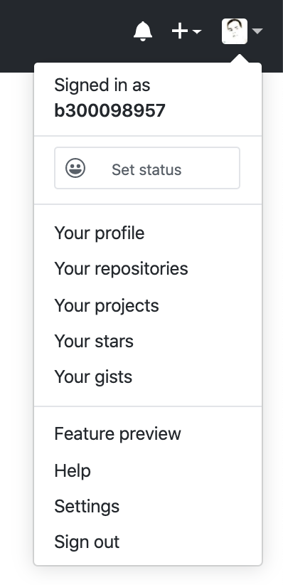
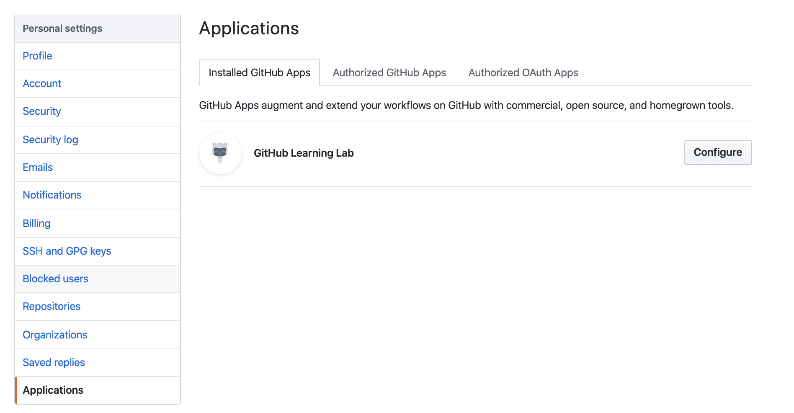

# Github Learning

### :o: Démarrage d'une nouvelle lecon 

</img>

### :a: Inscription à [Github Learning Lab](https://lab.github.com/)

:round_pushpin: Démarrer l'inscription

Si vous n'êtes pas encore inscrit, `Github Learning Lab` va vous demander l'installation de l'application dans votre profil

</img>

`Github Learning Lab` effectuera des actions et utilsera des ressources liées a votre compte.

:round_pushpin: Aprés avoir démarrer l'inscription, Accepter les conditions d'utilisation

</img>

:round_pushpin: Aprés avoir accepter les conditions d'utilisation, `Github Learning Lab` demandera si toutes les référentiels (repositories) peuvent être accédé

</img>

:round_pushpin: Confirmer l'installation

</img>

### :b: Commencer son premier cours sur [Github Learning Lab](https://lab.github.com)

:star: https://lab.github.com

:pushpin: Chercher son cours

</img>

:pushpin: Quand le cours est trouv/, cliquer sur son lien

</img>

:pushpin: Démarrer la nouvelle lecon

</img>

:pushpin: Accepter l'installation de la nouvelle lecon dans son compte

</img>

:bulb: Pour certaines lecons, assurz vous de sélectionner le `CLI` pour utiliser les commandes

</img>

### :ab: Vérifier l'installation de la nouvelle lecon dans son compte github

:bulb: https://github.com/ `(mon ` :id: ` github)`

</img>

## Vérification `Github Learning Lab` Application

:warning: Vérifier que l'Application `Github Learning Lab` est bien installée dans votre profil

:round_pushpin: Cliquez sur le sous-menu `settings` dans le menu de l'utilisateur

</img>

:round_pushpin: Cliquer le sous-menu `Applications` pour vérifier que l'application soit bien installée

</img>

:round_pushpin: Cliquer l'onglet `Authorized ...` pour vérifier qu'elle aie tous les droits

</img>
