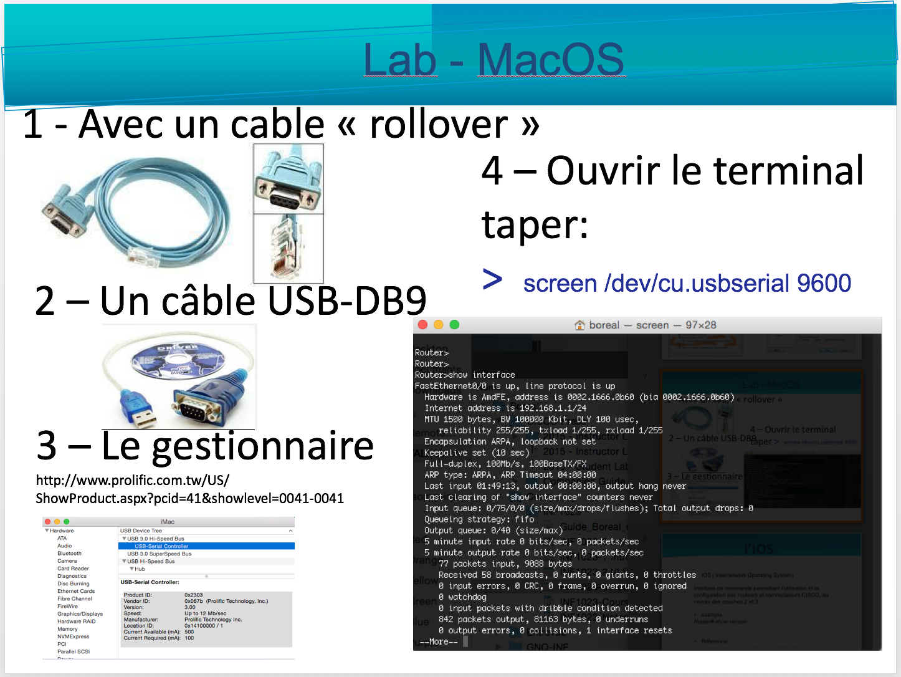

# CISCO Connection

# Pratique CCNA sur Internet 

(Proposé par Mostafa Bouchichi - CCNA: CSCO1336020)

https://ccnav6.com/

http://www.9tut.com/

https://www.udemy.com/ccna-on-demand-video-boot-camp/

https://www.cbtnuggets.com/it-training/cisco-ccna-icnd1-100-105

# A.Outils

## Packet Tracer

   https://www.netacad.com/resources/lab-downloads?courseLang=en-US

---

 ### Mac OS (prendre version 64 bits)
 
 https://wiki.winehq.org/MacOS
 
 https://www.xquartz.org/
 
 * Ouvrir le repertoire Wine
 
 ```
 $ open ~/.wine
 ```
 

# Driver

http://www.prolific.com.tw/US/ShowProduct.aspx?pcid=41&showlevel=0041-0041

## Windows


## MacOS



