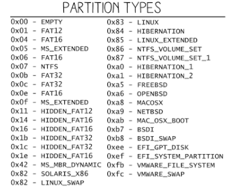

# Metal


## :one: Installation Proliant

* Installation sur Proliant GX

  :pushpin: Création de Clé USB:
   
    - Télécharger ISO sur Azure Education
    
    Logicel de boot de clé USB ? ([Rufus](https://github.com/CollegeBoreal/Tutoriels/tree/main/O.OS/2.Windows/servers/ISO), UnetBooting)
    
    Option pour booter la clé : 
    
   :pushpin: Système de fichier (Partition Scheme)
      
    * Master Boot Record [(MBR)](http://www.invoke-ir.com/2015/05/ontheforensictrail-part2.html) 

    * GUID Partition Table (GPT) - 2.2 TB Disks
    
    [:bulb: GPT vs MBR](https://www.howtogeek.com/193669/whats-the-difference-between-gpt-and-mbr-when-partitioning-a-drive)

   * Trouble Shoot quand boot unsuccessful

     [RedScreenOfDeath](https://github.com/CollegeBoreal/Laboratoires/blob/main/3202/proliant/TroubleShoot.md#pushpin-red-screen-of-death) 
     
  :pushpin: Boot
  
     * Basic Input Output System (BIOS)
     
     * Unified Extensible Firmware Interface (UEFI) 
     
      - can boot from drives of 2.2 TB or larger—in fact, the theoretical limit is 9.4 zettabytes
     
     * Preboot Execution Environment (PXE)
     
     [:bulb: BIOS vs UEFI](https://www.howtogeek.com/56958/htg-explains-how-uefi-will-replace-the-bios/)
              
    ISO Choisi ou suggéré
    
    - Windows Server 2019 - [Standard, Essential, Datacenter]
    
    - Windows `Hyper-V` Server 2019
    
   :pushpin: Disques [RAID](https://github.com/CollegeBoreal/Laboratoires/tree/main/3202/proliant/RAID)
   
    - Booter sur RAID Setup Utility `F8`
    
    - RAID :five: exigences
    
      formatter `3` disques minimum
      
    - Créer des disques logiques
    
      soit 3 disques a 146Gb donne 438Gb au final en RAID5 273Gb approxivement 62% de capacité d'utilisation
      
      soit 40% utilisé pour redondance pour `hot swap`
      
    :pushpin: Partition Types
    
    
    
    
    
   ## :x: Reset Proliant 
   
   https://serverfault.com/questions/662448/resetting-factory-defaults-hp-proliant-dl360-gen8
   
```
Actually, Your External USB keys were set to disable, its very simple to fix: remove the cover from your DL360PG8, plug your USB keyboard into the single USB port located "on the motherboard" in front of the power supplies, power up server & wait for F9 BIOS setting to come up at the end of post, here you will be able to get into the F9 settings command from your keyboard, at the 1st drop down menu in the F9 menu click "SYSTEM OPTIONS", scroll down 3 lines to "USB Options" & click, 1st option in the box will be "USB Control" & click on it, a gray box will open with 2 options, click on "USB Enable", after hit "Escape key" 3 times to exit and you will be all set. Good Luck!
```

## :two: Configuration

#### :electric_plug: Réseau Interne

- [x] `10.13.237.0/24` : Réseau

- [x] `10.13.237.1`: Passerelle

- [x] `borealc.on.ca`: DNS Search Domain

- [x] `1.1.1.1, 8.8.8.8`: DNS Servers

:bulb: Prenez une adresse dans la plage du réseau, assurez vous qu'elle est au dessus de `10.13.237.10`

#### :electric_plug: Réseau Externe

- [x] Éditer le fichier ci-dessous avec vos paramêtres

```
$ sudo nano /etc/netplan/00-installer-config.yaml 
# This is the network config written by 'subiquity'
network:
  ethernets:
    enp2s0f0:
      addresses:
         - 10.13.237.x/24
      routes:
         - to: default
           via: 10.13.237.1
      nameservers:
        addresses:
        - 1.1.1.1
        - 8.8.8.8
      dhcp4: false
    enp2s0f1:
      dhcp4: false
  version: 2
```

- [x] Appliquer le changement

```
$ sudo netplan apply
```

## :three: Installation de l'OS 

### :o: Accès à distance 

 * Accès coté client
 
    (OpenSSH or RDC):
    
    * Adresse IP
    
    * Nom
    
    * Mot de passe
          
## :four: Mémoire

Pour connaitre la mémoire physique

```
$ sudo lshw -c memory
```
          
# References

[MBR Boot Process](https://neosmart.net/wiki/mbr-boot-process)
