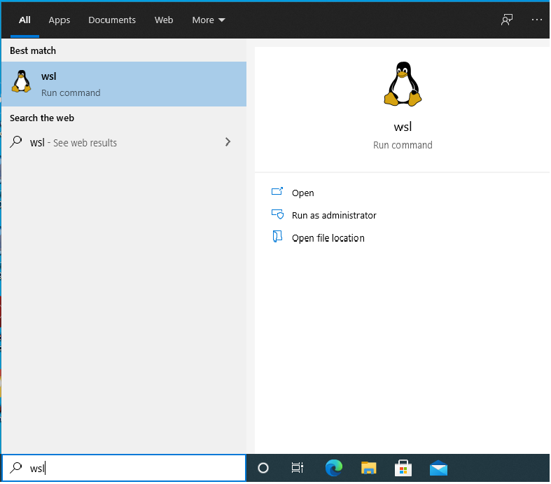
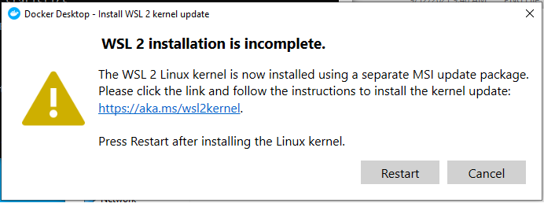
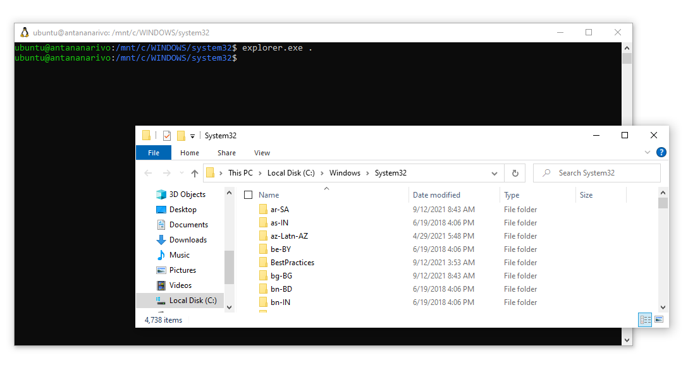
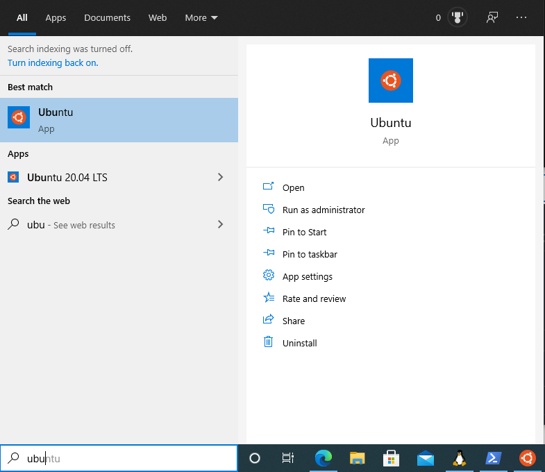
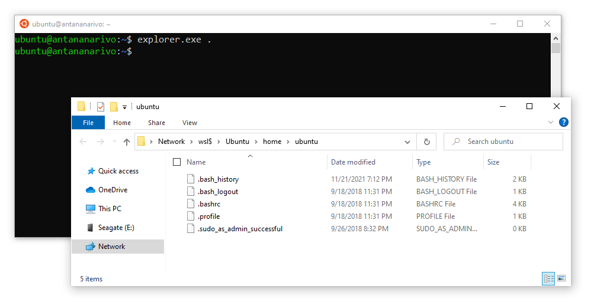

# WSDL

## :gear: Installation

Sous PowerShell

```powershell
Enable-WindowsOptionalFeature -Online -FeatureName Microsoft-Windows-Subsystem-Linux
```
## :a: Utilisation de `WSL`

    </img>

    </img>

    </img>


## :a: Utilisation `Ubuntu` sous `WSL`

   </img>

    </img>

