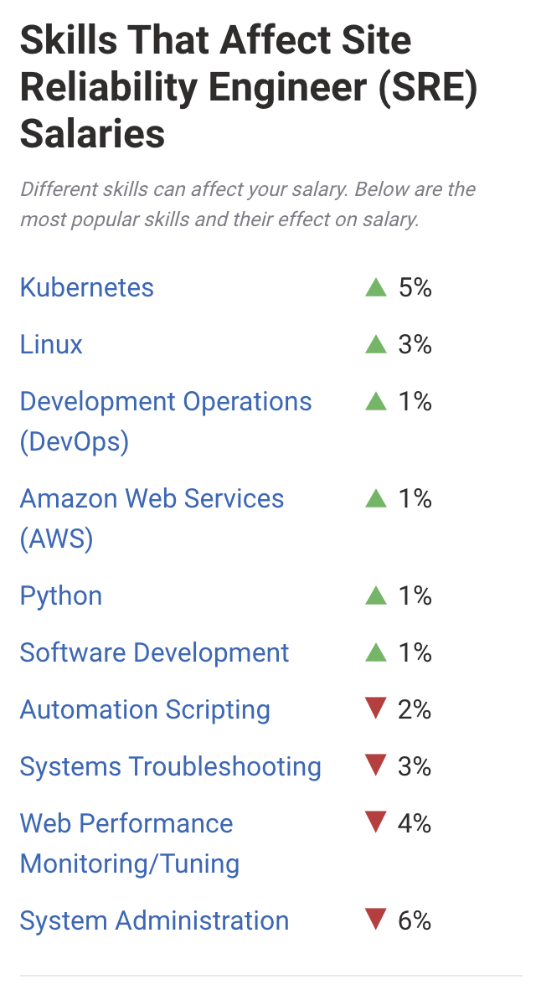

# S. Site Reliability Engineer (SRE)

    Hope is not a strategy.

    Traditional SRE saying

[Salaires](https://www.payscale.com/research/US/Job=Site_Reliability_Engineer_(SRE)/Salary)

</img>

## :a: Security

#### oAuth2

https://medium.com/@darutk/the-simplest-guide-to-oauth-2-0-8c71bd9a15bb

https://medium.com/@adriencrovetto/create-an-oauth2-provider-with-play-and-scala-c94f27cae44b

https://github.com/epot/play-silhouette-angular-typescript.g8

#### Quic

https://www.chromium.org/quic

#### cerbot

https://certbot.eff.org/

# Reference

https://landing.google.com/sre/books/

