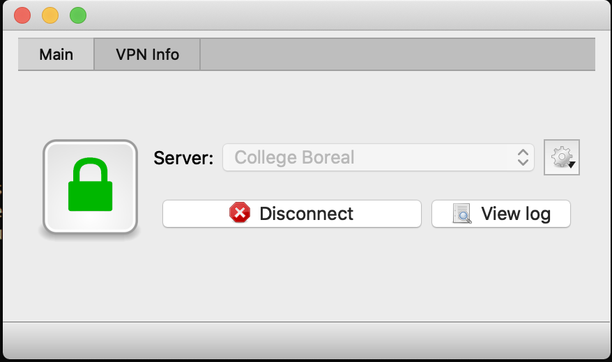

# VPN

## :x: Application

[Open Connect](http://www.infradead.org/openconnect/)

## :o: Installation

:m: Sur Windows de [OpenConnect-GUI](https://chocolatey.org/packages/openconnect-gui)

```
PS > choco install openconnect-gui
```

:m: Sur Mac de [OpenConnect-GUI](https://chocolatey.org/packages/openconnect-gui)

```
% brew cask install openconnect-gui
```

## :a: Connection

:pushpin: Créer un nouveau profil avec les données suivantes:

* l'URL de l'adresse VPN de Boréal

* Votre ID Boréal

:bulb: Vérifiez que le protocole `Cisco AnyConnect` est sélectionné

</img>

:pushpin: Se connecter avec le nouveau profil

</img>

:pushpin: Se connecter avec un terminal (bash) ou RDC (Remote Desktop Connection)


:pushpin: Se déconnecter du profil


</img>


# References

https://www.techrepublic.com/article/how-to-access-microsoft-remote-desktop-on-macos-sierra/

