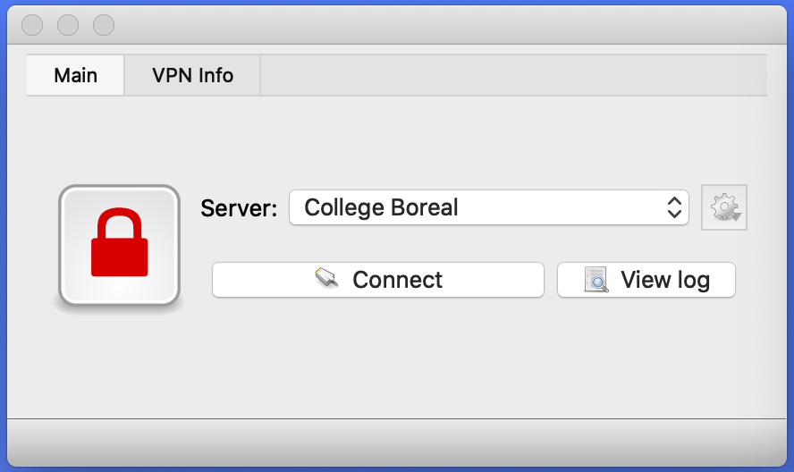
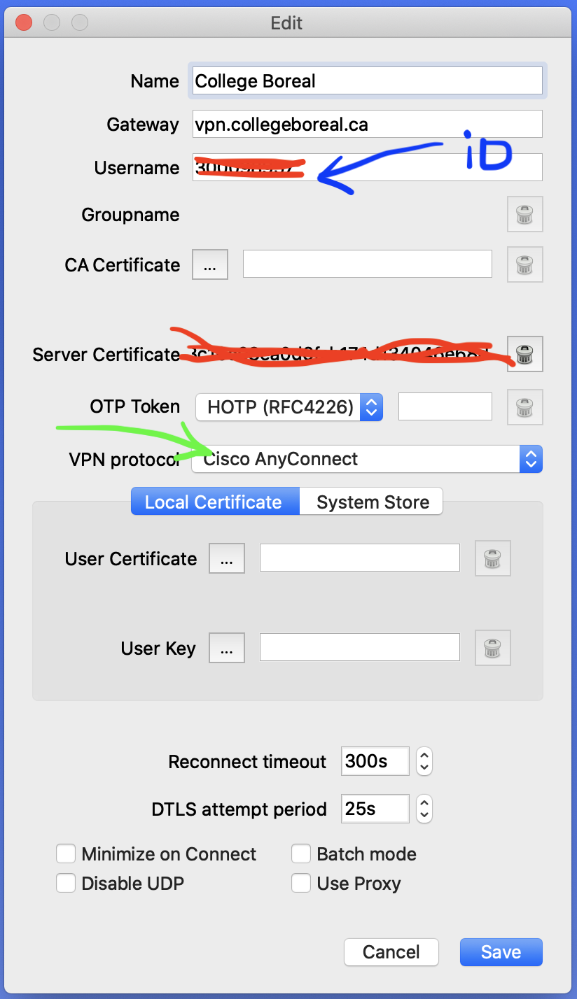

# VPN

## :x: Application

[Open Connect](http://www.infradead.org/openconnect/)

## :o: Installation

:m: Sur Windows de [OpenConnect-GUI](https://chocolatey.org/packages/openconnect-gui)

```
PS > choco install openconnect-gui
```

:m: Sur Mac de [OpenConnect-GUI](https://chocolatey.org/packages/openconnect-gui)

```
% brew cask install openconnect-gui
```

## :a: Connection

</img>

</img>

