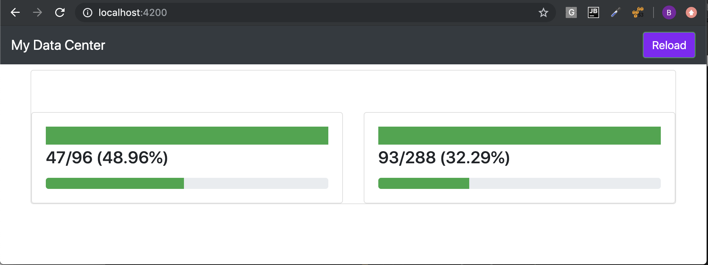

# Metric Component

### Generate the component

```
$ ng generate component metric
```

### Edit the component `metric.component.ts`

* Declare its variables

```typescript
  @Input() title: string = '';
  @Input() description: string = '';
  @Input('used') value = 0;
  @Input('available') max = 100;
```

* Declare its fonction `isDanger` monitoring the Metric Component

```typescript
  isDanger() {
    return this.value / this.max > 0.7;
  }
```

#### Final Result

```typescript
@Component({
  selector: 'app-metric',
  templateUrl: './metric.component.html',
  styleUrls: ['./metric.component.css']
})
export class MetricComponent implements OnInit {

  @Input() title: string = '';
  @Input() description: string = '';
  @Input('used') value: number = 0;
  @Input('available') max: number = 100;

  constructor() {
  }

  ngOnInit() {
  }

  isDanger() {
    return this.value / this.max > 0.7;
  }

}

```

### Edit its template `metric.component.html`

* Replace the template content by the below

```html
<div class="card card-block">
  <div class="card-body">
    <nav class="navbar navbar-dark bg-primary mb-1"
         [ngClass]="{'bg-danger': isDanger(), 'bg-success': !isDanger()}">
      <h1 class="navbar-brand mb-0">{{title}}</h1>
    </nav>
    <h4 class="card-title">{{value}}/{{max}} ({{value / max | percent:'1.0-2'}})</h4>
    <p class="card-text">
      {{description}}
    </p>
    <ngb-progressbar
      [value]="value"
      [max]="max"
      [type]="isDanger() ? 'danger' : 'success'">
    </ngb-progressbar>
  </div>
</div>

```

### Edit its template `dashboard.component.html`

* Call the `metric` component from `Dashboard`

```html
<div class="container mt-2">
  <div class="card card-block">
    <nav class="navbar navbar-dark bg-inverse mb-1">
      <h1 class="navbar-brand mb-0">Overall Metrics</h1>
    </nav>
    <div class="row">
      <app-metric class="col-sm-6"     
        [used]="cpu.used"     
        [available]="cpu.available"     
        [title]="'CPU'"     
        [description]="'utilization of CPU cores'">     
      </app-metric>     
      <app-metric class="col-sm-6"     
        [used]="mem.used"     
        [available]="mem.available"     
        [title]="'Memory'"     
        [description]="'utilization of memory in GB'">     
      </app-metric>     
    </div>
  </div>
</div>
```

## It should display




## Using Accessors to intercept @Inputs

:bookmark: `Accessors` ( get | set )

* replace the 2 variables below with accessor codes

```typescript
  @Input('used') value: number = 0;
  @Input('available') max: number = 100;
```

* with replacement code:

```typescript
  // --- USING ACCESSORS ---- START
  private _value: number = 0;
  private _max: number = 100;

  @Input('used')
  set value(value: number) {
    if (isNaN(value)) {
      value = 0;
    }
    this._value = value;
  }

  get value(): number {
    return this._value;
  }

  @Input('available')
  set max(max: number) {
    if (isNaN(max)) {
      max = 100;
    }
    this._max = max;
  }

  get max(): number {
    return this._max;
  }
  // --- USING ACCESSORS ---- END
```

## Final Result

```typescript
@Component({
  selector: 'app-metric',
  templateUrl: './metric.component.html',
  styleUrls: ['./metric.component.css']
})
export class MetricComponent implements OnInit {

  @Input() title: string = '';
  @Input() description: string = '';

  // --- USING ACCESSORS ---- START
  private _value: number = 0;
  private _max: number = 100;

  @Input('used')
  set value(value: number) {
    if (isNaN(value)) {
      value = 0;
    }
    this._value = value;
  }

  get value(): number {
    return this._value;
  }

  @Input('available')
  set max(max: number) {
    if (isNaN(max)) {
      max = 100;
    }
    this._max = max;
  }

  get max(): number {
    return this._max;
  }
  // --- USING ACCESSORS ---- END

  constructor() {
  }

  ngOnInit() {
  }

  isDanger() {
    return this.value / this.max > 0.7;
  }

}
```

[:fast_forward: Next ](node.md)
