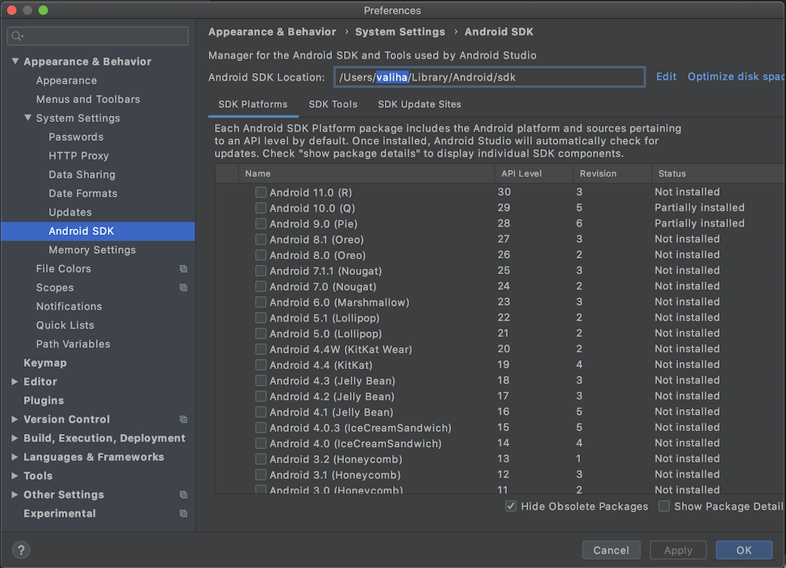

# IDE

## :o: Installation

Android 

:computer: Windows

```
PS > choco install androidstudio
``` 

:apple: MacOS

```
% brew cask install android-studio
```

La présente installation du `Playground Local` utilise [`HomeBrew`](https://brew.sh/) qui installe la SDK Android sous:

```
% echo $ANDROID_HOME
/usr/local/share/android-sdk
```


