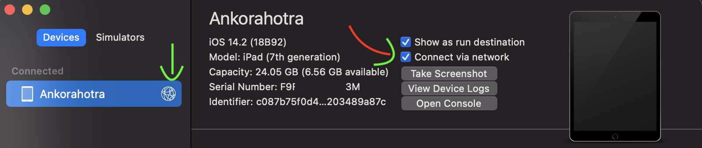
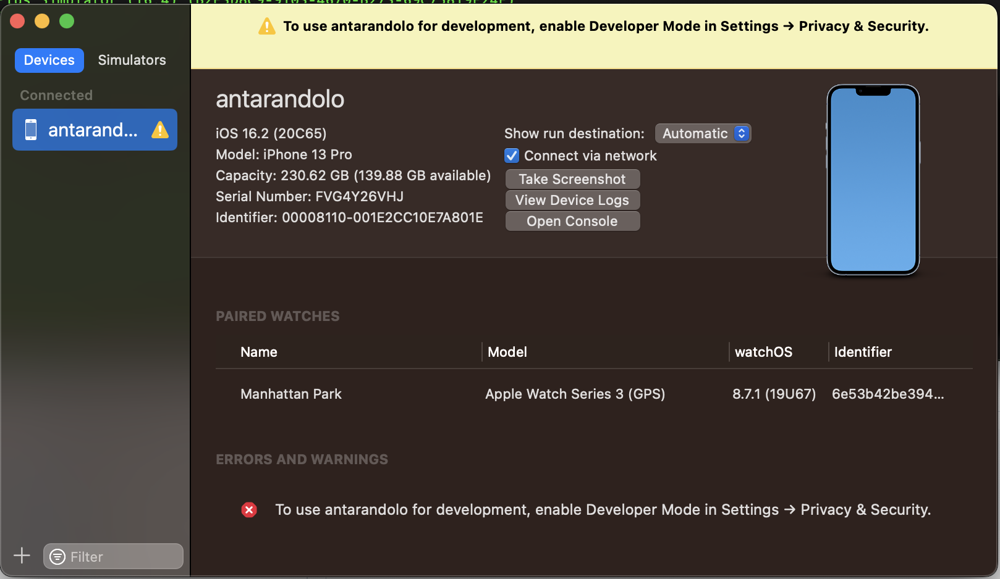
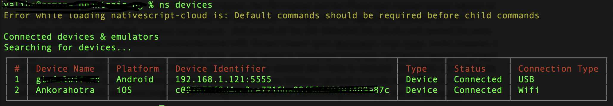

# iOS (WiFi)

## :o: Prérequis iOS

https://mycodetips.com/xcode/how-to-use-wireless-debugging-on-xcode-9-and-above-2491.html

Prerequis:
Équipement avec iOS 11.0 or plus récent installé
MacOS 10.12.4 ou récent avec XCode 9
Dev Mac Machine & Équipement doivent se trouver sur le même réseau (LAN)


## :a: Établir la connection avec iOS

Step 1: Connect your device via USB to the Mac Machine.

Step 2: Launch XCode 

Step 3: Go to ‘Window’ menu or Press (Shift + Command + 2)

Step 4: Select sub menu ‘Devices and Simulators’

Step 5: Select the ‘Devices’ tab and select the devices from the ‘Connected’ section.

Step 6: Select the ‘Connect via network’ checkbox and you are done.

Step 7: Now you can disconnect USB.






## :b: Vérifier la connection avec iOS


```
xcrun xctrace list devices
```
> Outputs :
```yaml
== Devices ==
iPad (14.2) (c087b75f0d4cc3ce7716ba095f0d4cc3ce7a87c)
ramena (3DE769BD-B8B6-58BE-B8B6-5AEB8B696FFE)
antarandolo (16.2) (00008110-001E2B8B6AB8B6801E)
```

Taper la commande: 

```
$ ns devices
```

Vérifier que l'équipement `iOS` aie une connection `Wifi`


